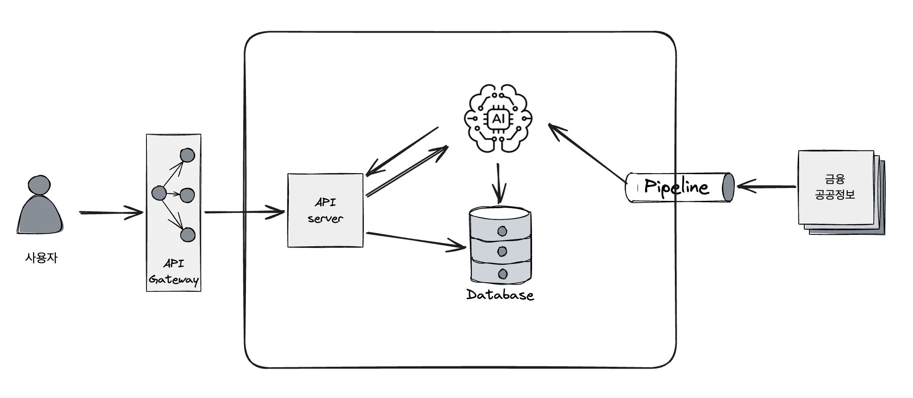

| 방향  | 흐름 |
| ------------- |-------------|
| 요청흐름  | 사용자앱 -> API G/W -> API 서버가 미션 요청 -> AI 모델이 학습 제공 |
|AI 적용| Instruction LLM+Context Prompting+RAG 로 실시간 안내 및 피드백 생성|
|AI 미적용| 정답 판정, 학습 결과 등은 API 서버에서 처리|
|외부 데이터|파이프 라인이 프록시를 경유해 조회 요청만 송신, AI 모델을 활용해 검증 및 절제 후 DB 에 적재|
